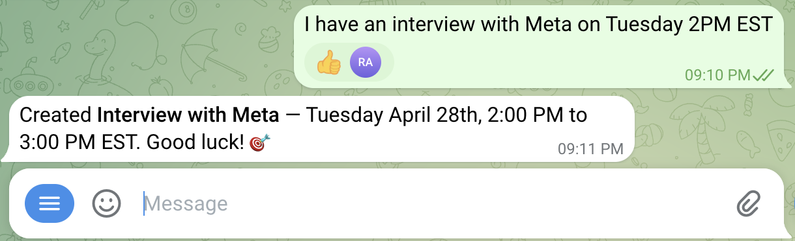

# Skills Marketplace

Plugin marketplace repo for Claude Code and other skill-compatible agents.

This repository can host multiple plugins. Right now it contains `calendar-skills` and `productivity`.

It can connect to OpenClaw or ZeroClaw through the same plugin and skill layout.

## Demo



## Installation

### Claude Code

```bash
claude plugin marketplace add ryanznie/skills
claude plugin install calendar-skills@skills
```

Restart Claude Code after installation. Skills activate automatically when relevant.

To install the new productivity plugin, use:

```bash
claude plugin install productivity@skills
```

**Update:**

```bash
claude plugin marketplace update
claude plugin update calendar-skills@skills
```

Or run `/plugin` to open the plugin manager.

### Other agents

For agents supporting the [skills.sh](https://skills.sh) ecosystem:

```bash
npx skills add ryanznie/skills
```

### Local development

```bash
git clone git@github.com:ryanznie/skills.git
cd <repo-dir>
claude --plugin-dir ./plugins/calendar-skills
```

To work on a different plugin in this repo, point `claude --plugin-dir` at that plugin's directory under `plugins/`.

## Available Plugins

| Plugin | Description |
|--------|-------------|
| `calendar-skills` | Zoom scheduling, Apple Calendar sync, and Google Calendar sync |
| `productivity` | Rigorous plan and design review |

## Current Skills

### `calendar-skills`

| Skill | Domain | Description |
|-------|--------|-------------|
| [ai-scheduler](plugins/calendar-skills/skills/ai-scheduler/SKILL.md) | Scheduling | Schedule Zoom meetings and send calendar invites via AgentMail |
| [apple-calendar-sync](plugins/calendar-skills/skills/apple-calendar-sync/SKILL.md) | Calendar | Create or update CalDAV and iCloud calendar events |
| [google-calendar-sync](plugins/calendar-skills/skills/google-calendar-sync/SKILL.md) | Calendar | Create or update Google Calendar events directly |

### `productivity`

| Skill | Domain | Description |
|-------|--------|-------------|
| [grill-me](plugins/productivity/skills/grill-me/SKILL.md) | Planning | Interrogate a plan or design until the tradeoffs are clear |

## Releases

Each plugin keeps its own semver in its `plugin.json`. The release flow uses a single workflow:

- [release.yml](.github/workflows/release.yml) publishes tags and performs the GitHub release for the selected plugin

Tag format:

- immutable patch tag: `vX.Y.Z+<plugin>`
- mutable minor tag: `vX.Y+<plugin>`

The release workflow lets you choose a semver bump, updates that plugin's `plugin.json`, creates both tags, checks out the tagged commit in a release job, and publishes the GitHub release from that exact version.

To run the workflow successfully, add a `RELEASE_TOKEN` repository secret with permission to create tags and GitHub releases.
