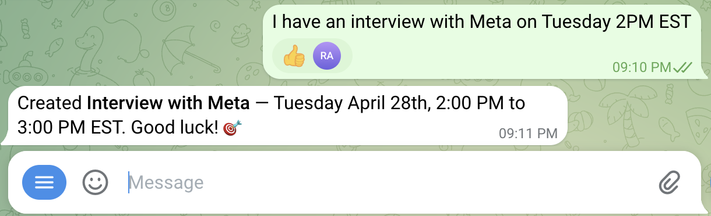

# Skills Marketplace

Plugin marketplace repo for Claude Code and other skill-compatible agents.

This repository can host multiple plugins. Right now it contains `calendar-skills` and `productivity`.

It can connect to OpenClaw or ZeroClaw through the same plugin and skill layout.

## Demo




## Installation

### Claude Code

```bash
claude plugin marketplace add ryanznie/skills
claude plugin install calendar-skills@skills
```

Restart Claude Code after installation. Skills activate automatically when relevant.

To install the new productivity plugin, use:

```bash
claude plugin install productivity@skills
```

**Update:**

```bash
claude plugin marketplace update
claude plugin update calendar-skills@skills
```

Or run `/plugin` to open the plugin manager.

### Other agents

For agents supporting the [skills.sh](https://skills.sh) ecosystem:

```bash
npx skills add ryanznie/skills
```

### Local development

See [docs/DEV_SETUP.md](docs/DEV_SETUP.md) for cloning, local plugin loading, Python setup, testing, and release procedures.

## Available Plugins

| Plugin | Description |
|--------|-------------|
| `calendar-skills` | Zoom scheduling, Apple Calendar sync, and Google Calendar sync |
| `productivity` | Rigorous plan and design review |

## Current Skills

The current `calendar-skills` plugin includes:

| Skill | Domain | Description |
|-------|--------|-------------|
| [ai-scheduler](plugins/calendar-skills/skills/ai-scheduler/SKILL.md) | Scheduling | Schedule Zoom meetings and send calendar invites via AgentMail |
| [apple-calendar-sync](plugins/calendar-skills/skills/apple-calendar-sync/SKILL.md) | Calendar | Create or update CalDAV and iCloud calendar events |
| [google-calendar-sync](plugins/calendar-skills/skills/google-calendar-sync/SKILL.md) | Calendar | Create or update Google Calendar events directly |

The `productivity` plugin includes:

| Skill | Domain | Description |
|-------|--------|-------------|
| [grill-me](plugins/productivity/skills/grill-me/SKILL.md) | Planning | Interrogate a plan or design until the tradeoffs are clear |

## Repository Structure

```text
.claude-plugin/marketplace.json
plugins/<plugin-name>/.claude-plugin/plugin.json
plugins/<plugin-name>/skills/<skill-name>/SKILL.md
assets/openclaw-zero-claw-demo.png
```

Each skill can include its own `scripts/`, `references/`, `assets/`, `templates/`, or `agents/` directories as needed.

## Releases

Release procedures, tag conventions, and workflow requirements are documented in [docs/DEV_SETUP.md](docs/DEV_SETUP.md).
